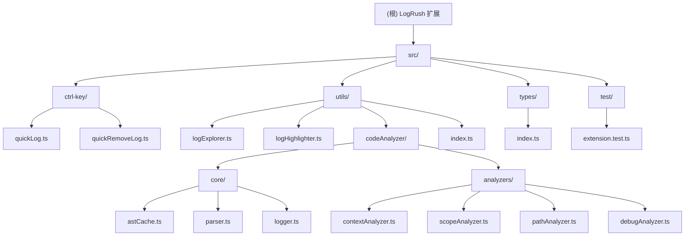

# LogRush - VSCode 扩展项目

> 一款强大的 VSCode 日志管理扩展，提供快速插入、管理和清理 console 语句的功能。

## 项目愿景

LogRush 致力于为开发者提供最高效的日志调试体验。通过智能的日志插入、灵活的格式定制和便捷的管理工具，让代码调试变得更加轻松和高效。

## 架构总览

LogRush 是一个基于 TypeScript 开发的 VSCode 扩展，采用模块化架构设计：

- **核心入口**: `extension.ts` - 扩展的激活和生命周期管理
- **日志插入**: `ctrl-key/quickLog.ts` - 处理快捷键和日志语句生成
- **日志管理**: `ctrl-key/quickRemoveLog.ts` - 处理日志的批量操作
- **代码分析**: `utils/codeAnalyzer/` - 使用 Babel 进行 AST 分析和作用域管理
- **UI 组件**: `utils/logExplorer.ts` - 日志浏览器侧边栏
- **高亮功能**: `utils/logHighlighter.ts` - 日志语句高亮和导航

## ✨ 模块结构图



## 模块索引

| 模块路径 | 职责描述 | 主要功能 |
|---------|---------|---------|
| `src/extension.ts` | 扩展入口点 | 激活扩展、注册命令、初始化组件 |
| `src/ctrl-key/` | 快捷键处理 | 日志插入、批量操作、快捷键绑定 |
| `src/utils/` | 工具组件 | 日志浏览、高亮显示、代码分析 |
| `src/types/` | 类型定义 | 接口、枚举和配置类型 |
| `src/test/` | 测试文件 | 单元测试和集成测试 |

## 运行与开发

### 环境要求
- Node.js 16.x+
- VSCode 1.2.0+
- TypeScript 5.7.3+

### 开发命令
```bash
# 安装依赖
pnpm install

# 开发模式（监听文件变化）
pnpm run watch

# 编译生产版本
pnpm run package

# 运行测试
pnpm run pretest

# 代码检查
pnpm run lint
```

### 调试
1. 在 VSCode 中打开项目
2. 按 F5 启动扩展开发主机
3. 在新窗口中测试扩展功能

## 测试策略

- **单元测试**: 使用 Mocha 框架进行核心功能测试
- **集成测试**: 测试扩展与 VSCode API 的交互
- **手动测试**: 验证用户体验和快捷键功能

## 编码规范

### TypeScript 规范
- 严格类型检查，使用接口定义所有数据结构
- 遵循 ESLint 配置进行代码格式化
- 使用 @ 别名进行模块导入

### 命名规范
- 文件名使用 kebab-case 或 camelCase
- 类名使用 PascalCase
- 函数和变量使用 camelCase
- 常量使用 UPPER_SNAKE_CASE

### 提交规范
- 使用中文进行提交信息描述
- 遵循约定式提交格式：feat:、fix:、docs: 等

## AI 使用指引

### 项目特点
- 主要是前端工具类扩展，专注于开发体验优化
- 使用 Babel 进行 JavaScript/TypeScript 代码解析
- 大量使用 VSCode 扩展 API 进行编辑器交互

### 代码分析要点
- 关注 AST 操作和代码结构分析的实现
- 注意扩展激活和命令注册的生命周期
- 理解用户配置系统和格式化逻辑
- 熟悉 VSCode TreeView API 和文件系统操作

### 开发建议
- 优先考虑用户体验和操作流畅性
- 保持代码的模块化和可维护性
- 充分利用 VSCode 提供的原生 API
- 注意性能优化，特别是大文件处理

---

## 变更记录 (Changelog)

### 2025-11-26 23:36:24
- 初始化项目 AI 上下文和文档结构
- 创建模块化架构文档
- 添加 Mermaid 结构图和模块索引